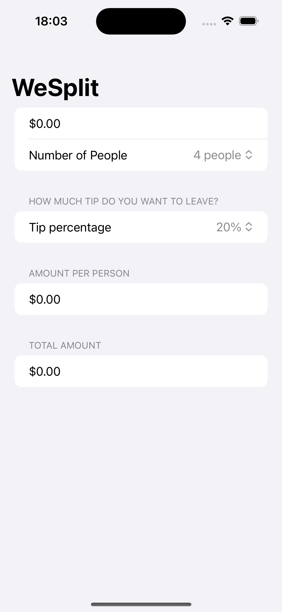
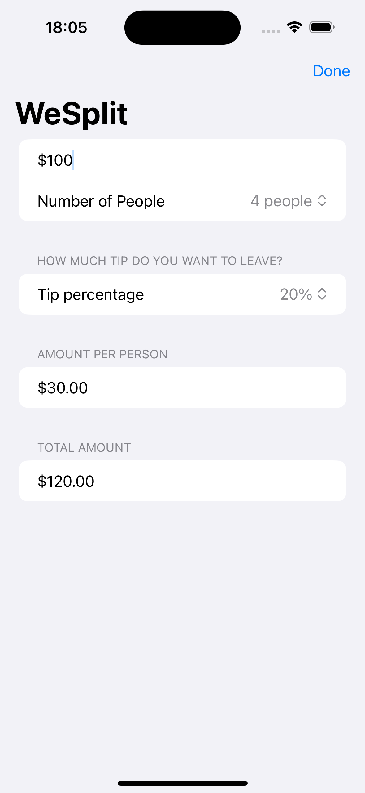

# WeSplit

Welcome to WeSplit! This app makes splitting the bill after a meal with friends easy and convenient.

## Features

- Enter the total cost of the meal.
- Select the tip percentage.
- Specify the number of people sharing the bill.
- Get instant calculations on how much each person needs to pay.

## How to Use

1. **Enter the Total Cost**: Input the total amount of the bill, including tax and any additional charges.

2. **Select Tip Percentage**: Choose the percentage of tip you want to leave. You can choose from standard options like 15%, 18%, or 20%, or enter a custom percentage.

3. **Specify Number of People**: Enter the number of people splitting the bill.

4. **View Results**: WeSplit will instantly calculate the amount each person needs to pay, including the total cost, tip amount, and individual share.

## Technologies Used

- Swift programming language for iOS development.
- Auto Layout for responsive design.

## Screenshots

## License

WeSplit is licensed under the [LICENSE](LICENSE). You are free to use, modify, and distribute the app as per the terms of the license.
